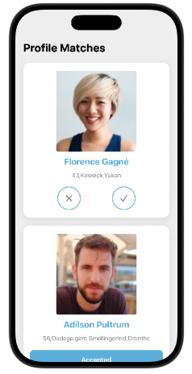
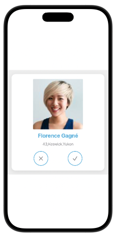
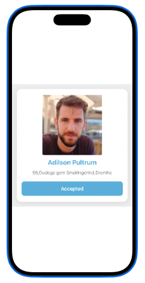

# MatchMate

MatchMate is a modern iOS matchmaking-style application built using **SwiftUI**.  
It demonstrates a clean and scalable architecture using **MVVM + Repository pattern**, with offline-first support using **Core Data**.

The app focuses on smooth UI interactions like accepting and declining profiles, while ensuring data persistence and offline usability.

---

## Features

- Browse user profiles in a clean card-based UI  
- ✅ Accept / ❌ Decline match functionality  
- 💾 Persistent storage using Core Data  
- 🌐 API-based profile fetching using URLSession  
- 🔄 Offline-first support with cached data  
- Reactive UI updates using Combine / @Published  
- Fully SwiftUI-based modern UI  

---

## 🧱 Architecture

MatchMate follows a clean **MVVM + Repository architecture**:

SwiftUI Views
↓
ViewModel (State Management)
↓
Repository (Single Source of Truth)
↓
Data Sources (API / Core Data)


### Key Idea

- UI is completely decoupled from data sources  
- Repository decides whether data comes from **network or local storage**  
- ViewModels only handle UI state and business flow  

---

## Design Principles

- Separation of concerns  
- Single responsibility per layer  
- Offline-first data strategy  
- Scalable and testable architecture  
- Reactive UI updates  

---

## Tech Stack

- Swift 5+
- SwiftUI
- Combine
- Core Data
- URLSession
- MVVM Architecture

---

## Data Persistence

The app stores:

- User profiles  
- Match status (Accepted / Declined)  
- Cached API responses  

✔ Data is automatically restored when the app is relaunched  
✔ Works seamlessly in offline mode  

---

## Match Flow

### ✅ Accept Profile
- Updates status to **Accepted**
- Saves state in Core Data
- UI updates instantly

### ❌ Decline Profile
- Updates status to **Declined**
- Persists locally
- Updates or removes card from UI

---

## 🌐 Offline Support

- Profiles are cached after first API fetch  
- App continues working without internet  
- Core Data acts as fallback storage  
- Auto-sync when network is restored  

---

## 📸 Screenshots

### 🧑‍🤝‍🧑 Match List Screen
Shows all available profiles in a clean card-based layout.



---

### 👤 Profile Card View
Displays full user details with Accept / Decline actions.



---

### ✅ Accepted State

Shows UI update after accepting a profile.



## Getting Started

### Requirements

- Xcode 15+
- iOS 16+
- Swift 5.9+

### ⚙️ Installation

```bash
git clone https://github.com/yourusername/MatchMate.git
cd MatchMate
open MatchMate.xcodeproj

## 📈 Future Improvements

- 🔍 Search and filter profiles for better discovery  
- 💬 Chat feature enabled after a successful match  
- 🔔 Push notifications for real-time updates  
- ☁️ Cloud sync using CloudKit / Firebase for cross-device support  
- 🧪 Full unit and UI test coverage for improved reliability  
- 🎨 Enhanced animations and smoother transitions for better UX  

